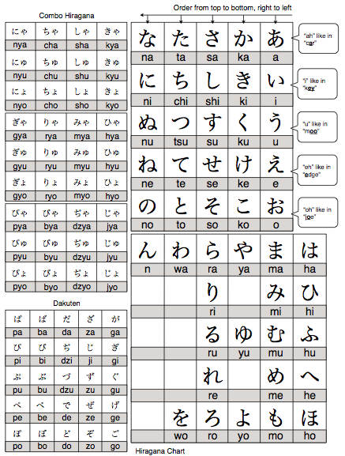
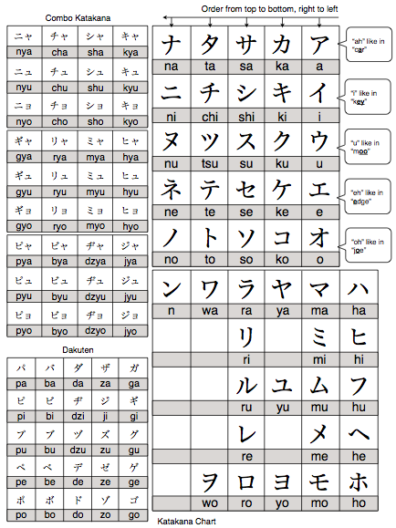

## - Kitacon Quest -
# [fit] An Anime Fan's Guide to
# [fit] Learning Japanese

#### by James O'Neill

---

# [fit] Learn Hiragana

---

---

# Hiragana (ひらがな)

- 51 phonetic characters.
- Each character represents a single sound.
- Organised in blocks of 5.

---

# How to Learn Hiragana

- Believe in the me that believes in you!
- Download / print hiragana chart and put it somewhere where you'll see it often. (http://www.textfugu.com/resources/hiragana-chart/)
- Learn 3 - 5 new characters per day.
- Drill characters whenever you get the chance.
- Use a flashcard app.
- Use a kana textbook to practice reading.

---

# [fit] Learn Katakana

---

---

# Katakana (カタカナ)

- Mainly used to sound out foreign loan words.
- Represent the same set of sounds as hiragana.
- Similar to upper / lower case in English.
- Also used for emphasis and onomatopoeia.

---

# How to Lean Katakana

- Repeat the same methods as with Hiragana.
- Try to sound out English words using katakana.

---

# [fit] Learn Vocab & Grammar

---

# Vocab & Grammar

- Japanese grammar structure is very different to English.
- Trying to literally translate sentences leads to awkward results.
- Expose yourself to as much natural Japanese as possible to develop an ear for what it should sound like.

---

# Vocab & Grammar

- If you're self studying then audio lessons and podcasts are your friend.
- Beginner text books are a good source of basic Japanese, although the grammar can be stiff.
- Tae Kim's grammar guide (http://www.guidetojapanese.org/learn/) is an excellent overview of sentence structure.
- Many people like JapanesePod101 but but it's very aggressive on sales.

---

# [fit] Learn Kanji

---

# Kanji (漢字)

- Pictographic characters adapted from Chinese.
- Used to represent the meaning of words.
- 2,136 "daily use" characters required for basic adult literacy!
- Most characters have multiple readings.

---
# Kanji (漢字)

- Most kanji are made up of "radicals", smaller components that make up a bigger picture.
- Radicals have their own meanings, when combined they represent the meaning of a character, often in an abstract way.

---

# Kanji (漢字)

- Japanese children learn kanji by constant repetition. This is slow.
- The learn characters with simpler meanings first, not simpler characters.
- Many Japanese classes will teach kanji in this order, not expecting you to learn them.
- There are better ways to learn kanji.

---

# Kanji (漢字)

- Study the radicals as well as the characters.
- Learn characters roughly in order of written complexity.
- Practice hand writing but don't mindlessly repeat the same character.
- When you learn  new words try to learn how they are written at the same time.
- Focus on learning key words for a character over learning all its readings.

---

# Kanji Learning Resources

- "Reading the Kanji" by James Heisig
- WaniKani (https://www.wanikani.com/)

